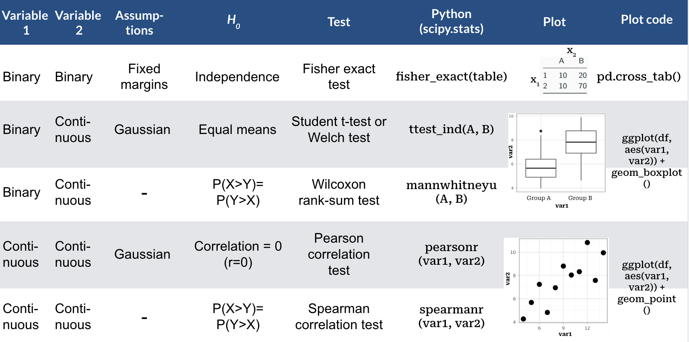

```{python}
#| include: false
import numpy as np
import pandas as pd
import seaborn as sns
import matplotlib.pyplot as plt
from plotnine import *


# Set theme similar to original
mysize = 9
mytheme = (theme_bw() +
           theme(axis_title=element_text(size=mysize),
                 axis_text=element_text(size=mysize),
                 legend_title=element_text(size=mysize),
                 legend_text=element_text(size=mysize)))

np.random.seed(20)
```

In the last chapter we discussed how trends in data can arise by chance, leading us to wrong conclusions. We saw that statistical hypothesis testing can help to guard us from being fooled by randomness in this way. We developed the permutation test as an empirical way to perform hypothesis tests.

While permutation testing is very general and requires few assumptions, it has its limitations, as we will see shortly. In this chapter, we will therefore discuss a more analytical approach to testing. We will see several classical tests, such as the binomial test and the t-test. These tests often make stronger assumptions about the underlying data. Thus, it is important to understand when they can and cannot be used. 

In the last chapter we also touched on the topic of confidence intervals, which help us quantify the uncertainty of our estimates, and also developed an empirical way to compute them. In this chapter, we will briefly describe how to compute them analytically. 


## Motivation: Hypothesis testing in large datasets

We have already discussed how to test specific hypotheses, for instance considering the association between a genetic marker and growth rate in the yeast dataset (See @sec-resampling-chp). However, in the era of big data, we often do not restrict ourselves to testing just one single hypothesis. Molecular biologists can nowadays measure RNA abundance of all genes of a cell population. So what if we test the association of the RNA abundance of all ~8,000 yeast genes with every single genetic markers? For 1,000 genetic markers, this means we will have to do more than 8 million tests! 

Doing this many tests can lead to misleading results. Let us assume, for the sake of argument, that our null hypothesis is always true and there is never an association between RNA abundance and markers. If we reject this null hypothesis every time we observe $P\leq 0.05$, we will falsely reject the null hypothesis in roughly 5% of the tests we do. With 8 million tests, we will then falsely reject the null hypothesis 400,000 times.

This issue is called **multiple testing** and strategies to deal with this problem will be discussed in detail in the next chapter. For now, it suffices to say that when we do many tests, we will usually require far lower $P$-values to reject the null hypothesis, to guard against the problem described above.

With permutation testing, we estimated $P$-values using $P=\frac{r+1}{m+1}$, where $m$ is the number of permutations (@eq-permut-p-val). It follows that, with this method, the $P$-values we can compute will never be smaller than $\frac{1}{m+1}$. If we now say that we will only reject the null hypothesis if, for example, $P\leq 0.001$, then we will need at least $m=1,000$ permutations, otherwise our test simply cannot reject the null hypothesis, regardless of the true associations in the data. Since we are doing 8 million tests, this means we will end up doing more than 8 billion permutations. Hence, permutation testing can become very costly in terms of computing power and time. We thus require more scalable ways to estimate $P$-values for large datasets. This Chapter provides methods for which $P$-values are computed from the observed test statistics directly.

## The Binomial Test: testing hypotheses for a single binary variable

The first test we will look at is the binomial test. We use it when we want to test hypotheses concerning one binary variable.

### Abstraction: Tossing a coin

To develop the binomial test, we consider an abstract example, namely testing whether a coin is biased. 

We first introduce some notation. Let:

* $n$: the total number of independent random tosses of the coin.
* $X_i$: the value of the i-th toss, with $X_i=1$ if the result is head and $X_i=0$ if it is tail. 
* $\mu = E(X_i) = p(X_i=1)$: the probability of getting a head.

We assume the $X_i$ to be i.i.d.

As we will see again and again in this chapter, to develop a statistical test we require three ingredients:

* A null hypothesis $H_0$ (and a suitable alternative hypothesis $H_1$, either one or two-sided)
* A test statistic $T$
* The distribution of this test statistic under the null hypothesis, $p(T|H_0)$

(Note that in permutation testing the sampling procedure simulated the distribution of our test statistic under the null hypothesis.)

To test whether a coin is biased, our null hypothesis is that the coin is fair: 

$H_0: \mu=0.5$

And our alternative is that it is biased (either towards heads or tails):

$H_1: \mu\neq0.5$

As test statistic, we will use the total number of heads, i.e. $T=\sum_i X_i$.

#### A single coin toss

Now assume, for the sake of argument, we toss the coin only once ($n=1$) and get a head ($T_\text{obs}=1$). What is the two-sided $P$-value in this case?

In this scenario, there are of course only 2 possible outcomes. Either we get one head or we get one tail. Under the null hypothesis, both outcomes are equally likely. Therefore, the distribution of the test statistic under the null hypothesis is given by:

$$p(T = 0 | H_0) = 0.5 = p(T = 1 | H_0)$$ 
The two-sided $P$-value is then given by:

$$P = 2\min \{p(T \leq T_\text{obs}| H_0), p(T \geq T_\text{obs}| H_0) \}$$

$$= 2\times0.5$$

$$= 1$$

Thus, if we only performed a single coin toss, the data cannot provide sufficient evidence for rejecting the null hypothesis in a two-sided test. This, of course, does not allow us to conclude that the null hypothesis is correct. In particular, we cannot write that "$p(H_0) = p(\mu=0.5) = 1$". After all, we could have generated the same data with a coin that has heads on both sides, for which the null hypothesis clearly does not hold. Another way to look at it, is to state that the data does not provide sufficient evidence to conclude that the coin is biased.

#### Tossing the coin several times

Now assume we toss the coin $n \gt 1$ times and observe $T_\text{obs}$ heads. What is the distribution of the test statistic under the null hypothesis now?

We can easily simulate data under this assumption in Python by sampling from Bernoulli distribution `n` times. The probability for each outcome can be provided with the ```prob``` argument.  Here is one such simulation of $n=10$ trials under the null hypothesis $\mu=0.5$.   


```{python}
from scipy.stats import bernoulli
n = 10
prob = 0.5
x = bernoulli.rvs(prob, size = n)
x
```

Our test statistic $T$ is the sum of heads:

```{python}
t = sum(x)
print(t)
```


The probability of observing $T$ heads after tossing a coin $n$ times is given by the binomial distribution, which is the binomial coefficient, i.e. the number of possible sequences of events with the same total number of heads, times the probability of a given sequence, which is itself the product of the probability of each individual realization (i.i.d. assumption):

$$p(T|n, \mu) = \binom{n}{T}\mu^T(1-\mu)^{n-T}$$

Hence, assuming the null hypothesis is true, we get that:

$$p(T|n, \mu=0.5) = \binom{n}{T}0.5^n$$

```{python}
#| eval: true
#| echo: false
t = int(t)
```


This is implemented in `scipy.stats` library in Python with the function ```binom```^[ in `scipy.stats` every distribution (e.g., normal, binomial) is implemented as a class object, providing consistent methods such as `.cdf()` (cumulative distribution function), `.pdf()` (probability density function), and `.rvs()` (random variates sampling)]. The probability to have observed exactly `{python} t` heads is therefore:

```{python}
from scipy.stats import binom
binom.pmf(k=t, n=n, p=0.5)
```


We recall that the $P$-value is defined as the probability, under the null hypothesis, of observing a test statistic as or more extreme as the one we actually observed. Since we just want to know *whether* the coin is biased, and do not care in which direction, we need a two sided  $P$-value. This is given by (Figure @fig-binom-test):

$$
\begin{aligned}
P &= 2\min \left\{p(T \leq T_\text{obs}| H_0), p(T \geq T_\text{obs}| H_0) \right\} \\
&= 2\min\left\{\sum_{T \leq T_\text{obs}}\binom{n}{T}0.5^n, \sum_{T \geq T_\text{obs}}\binom{n}{T}0.5^n \right\}
\end{aligned}
$$ {#eq-p-val-binom}

```{python}
#| echo: false
#| fig-align: center
#| fig-cap: Two-sided $P$-value for the coin tossing example. The two-sided $P$-value equals to twice the sum of the probabilities (twice the total red area) under the null hypothesis of the realizations equal or more extreme than the observed one (vertical line).
#| label: "fig-binom-test"
t_rnd = np.arange(n + 1)
p_T_H0 = binom.pmf(t_rnd, n=n, p=0.5)

df = pd.DataFrame({
    "t_rnd": t_rnd,
    "p_T_H0": p_T_H0
})
df["reject"] = np.where(df["t_rnd"] >= t, "TRUE", "FALSE")

(
    ggplot(df, aes(x="t_rnd", y="p_T_H0", fill="reject")) 
    + geom_bar(stat="identity") 
    + labs(
        x="T (Number of Successes)", 
        y=r"$p(T \mid H_0)$" 
    )
    + scale_x_continuous(breaks=t_rnd) 
    + scale_fill_manual(
        name="T >= T observed", 
        values={"FALSE": "darkgrey", "TRUE": "red"}
    )
    + geom_vline(xintercept=t, linetype="dashed", size=1)
    + mytheme
)
```

To apply the formula @eq-p-val-binom, one can compute the smaller of the two terms which is here $\sum_{T \geq 7}\binom{10}{T}0.5^{10}$, and corresponds to the right tail marked in red in Figure @fig-binom-test. This is $1- \sum_{T \leq 6}\binom{10}{T}0.5^{10}$ and is obtained in Python with:

```{python}
1-binom.cdf(k = t-1, n=n, p=0.5)
```

Hence the two-sided $P$-value is twice this value, yielding:
```{python}
2*(1-binom.cdf(k = t-1, n=n, p=0.5))
```

Altogether we have $P=$ `{python} float(2*(1-binom.cdf(k = t-1, n=n, p=0.5)))`. We do not reject the null hypothesis that the coin is fair at a significance level of 0.05.


### Computing a binomial test with Python

In actual applications, we use the `scipy.stats.binomtest` function of Python. For the example above, we do:

```{python}
from scipy.stats import binomtest
binomtest(t, n, p=0.5, alternative="two-sided")
```

We see that the function has three parameters, which correspond to $T_{obs}$, $n$ and the $\mu$ under $H_0$ respectively (R calls the last one $p$). Additionally, we can specify whether we want a two-sided or one-sided test using the "alternative" option. The options are "two-sided", "greater" and "less".

We also see that the function returns an object, which summarizes the test that was performed. If we want to just get the $P$-value, we do:
```{python}
test = binomtest(t, n, p=0.5, alternative="two-sided")
test.pvalue
```

<!-- Note that `scipy.stats.binomtest` also returns sample estimates of the probability of success and confidence intervals. Section \@ref(analytical-conf-int) provides explanations.  -->


## Fisher's exact test: Testing the association between two binary variables {#sec-fisher-test}

Suppose we are trying to determine whether people who smoke are more likely to develop severe symptoms if they contract a respiratory virus than non-smokers. For this we collect data from $n=110$ randomly sampled patients.

Assume we receive the following table as a result:

```{python}
#| echo: false
cont_table = pd.DataFrame(
    {
        "Severe": [10, 10],
        "Mild": [20, 70]
    },
    index = ["Smoker", "Nonsmoker"]
)

cont_table
```

We see that 30 of the patients were smokers, whereas 80 were non-smokers. We further observe that only $\frac{1}{8}$th of non-smokers developed severe symptoms, whereas $\frac{1}{3}$rd of the smokers did. The **odds** are 1:2 (10 severe versus 20 mild) for infected smokers to develop severe symptoms against 1:7 (10 severe versus 70 mild) for non-smokers. Hence, these data suggests that there is relationship between smoking and developing severe symptoms, with odds about 3.5 times higher for smokers than for non-smokers.     

Once again, we need to make sure that these results are statistically significant. We cannot use the binomial test, because now we are not just considering one binary variable, but rather we are investigating the relationship between two binary variables. ^[It would also not be ideal to use the binomial test on the smoker data by fixing the probability under the null to the probability estimated on the non-smokers, because that probability would be a noisy estimate] 

### Permutation testing and the hypergeometric distribution

It is enlightening to approach first this problem with permutation testing (See Chapter @sec-resampling-chp). To this end, one shall first consider the underlying, not aggregated, dataset of individual cases. Such tidy dataset, where one row is one patient and each column one variable, would have the following structure:

```{python}
#| echo: false
n = 5
patients = [f"patient_{i}" for i in range(1, n + 1)]
smoker = np.random.choice(["yes", "no"], size=n, replace=True)
symptoms = np.random.choice(["severe", "mild"], size=n, replace=True)

df_long = pd.DataFrame({
    "Patient": patients,
    "Smoker": smoker,
    "Symptoms": symptoms
})

df_long.loc[n] = ["...", "...", "..."]
df_long
```

For permutation testing, the null hypothesis is the independence of the Smoker and the Symptoms variables. With permutation testing, data under the null hypothesis are simulated by permuting values in one column (say "Symptoms") keeping the order of the other column (say "Smoker") fixed. For each permutation, we get a different 2x2 *contingency table* which we will denote as:

```{python}
#| echo: false
conttbl = pd.DataFrame(
    {
        "Severe": ["a", "c", "a + c"],
        "Mild": ["b", "d", "b + d"],
        "Row total": ["a + b", "c + d", "n = a + b + c + d"]
    },
    index=["Smoker", "Non-smoker", "Column total"]
)

# Display the table (Jupyter/Quarto will render this nicely)
conttbl
```

Note that any such permutation keeps the size of the dataset, the total number of smokers as well as the total number of patients with severe symptoms constant. We say that these permutations keep the margins (row and column totals) of the contingency table constant.


Consequently, one cell in the 2x2 contingency table suffices to characterize the entire table because all other counts can then be derived using the margins. Therefore, we can use any cell in the table as test statistic, but we usually use $a$, i.e. the upper left corner.

The good news is that the distribution of $a$ under the null hypothesis (i.e. its frequency among all possible distinct permutations) can be exactly computed. It is given by the hypergeometric distribution ^[More details at <https://en.wikipedia.org/wiki/Hypergeometric_distribution>]:

$$p(k=a|H_0) = \frac{(a+b)!(c+d)!(a+c)!(b+d)!}{a!b!c!d!n!}$$


### Fisher's exact test

Using the hypergeometric distribution, we can now derive $P$-values, in the same way as we did before, namely by summing the probability of observing a test statistic as, or more, extreme as the one we observed. So, to compute the one-sided $P$-value, we would use:

$$P = \sum_{i \geq a}p(k=i|H_0)$$

This is called Fisher's exact test.

For our application purposes, we do not need to know the formula of the hypergeometric distribution, nor how it is derived. However, it is important to know that a formula exists and what the underlying assumptions are, i.e. that the margins of the 2x2 contingency table are considered to be fixed. That means that we do not consider $n$, $a+b$, $b+d$, $a+c$ and $c+d$ as random variables, but instead take these quantities as given (we "condition" on them). Note that this assumption is often violated in practice, as in the example above where we randomly sampled patients rather than sampling a fixed amount from each subgroup. But Fisher's exact test is nevertheless applied as an exact instance of permutation testing.

There are alternatives to Fisher's exact test that do not need all margins fixed assumptions. One is the formerly popular Chi-squared test, which is based on large number approximations. It is rarely needed nowadays, as Fisher's exact test is exact and fast to compute. Another approach is based on logistic regression and will be addressed in a later Chapter.

### Fisher's exact test in Python

In Python, we can perform Fisher's exact test using `fisher_exact` function from `scipy.stats`. As for the binomial test, the $P$-value can be extracted with `.pvalue`. This requires a contingency table as input. For our contingency table, we get:
```{python}
cont_table = pd.DataFrame(
    {
        "Severe": [10, 10],
        "Mild": [20, 70]
    },
    index = ["Smoker", "Nonsmoker"]
)
cont_table

from scipy.stats import fisher_exact
tst = fisher_exact(cont_table, alternative="greater")
tst.pvalue
```
The one-sided $P$-value is `{python} float(tst.pvalue)`. At the level $\alpha=0.05$, one would therefore reject the null hypothesis of independence of symptom severity and smoking status.


## Testing the association between one quantitative and one binary variable

We asked earlier on the yeast dataset (Section @sec-yeast-dataset) whether the genotype at marker 5211 significantly associates with growth rates in Maltose media. We saw that yeast strains which have the wild isolate genotype seemed to generally grow faster than those which had the lab strain genotype at this particular marker:

```{python}
#| echo: false

genotype = pd.read_csv("../../extdata/eqtl/genotype.txt", sep="\t")
genotype = genotype.melt(
    id_vars="strain", 
    var_name="marker", 
    value_name="genotype"
)
marker = pd.read_csv("../../extdata/eqtl/marker.txt", sep="\t")
growth = pd.read_csv("../../extdata/eqtl/growth.txt", sep="\t")
growth = pd.melt(
  growth,
  id_vars="strain",
  var_name="media",
  value_name="growth_rate"
)
```


```{python}
#| fig-align: center
#| echo: false 
#| warning: false

mk = marker.loc[
    (marker["chrom"] == "chr07") & (marker["start"] == 1069229),
    "id"
    ].item()

growth_sub = growth[growth["media"] == "YPMalt"]
genotype_sub = genotype[genotype["marker"] == mk][["strain", "genotype"]]

dt = pd.merge(growth_sub, genotype_sub, on="strain")

p = (
  ggplot(dt, aes(x="genotype", y="growth_rate"))
  + geom_boxplot()
  + labs(
    x=f"Genotype at {mk}",
    y="Growth rate in Maltose\n[Generations/day]"
    )
  + mytheme
)

p
```

Here we are evaluating the association between a binary variable (the genotype at marker 5211) and a quantitative variable (the growth rate in Maltose media). This scenario does not fit the tests we have seen previously. We have to develop a new one.

To formalize this problem, we first note that the binary variable splits the quantitative data into two groups. Let $X = x_1, ..., x_{n_x}$ be the quantitative data of the first group (i.e. the growth rates of yeast strains with lab strain genotype), and $Y = y_1, ..., y_{n_y}$ be the quantitative data of the second group (i.e. the growth rates of yeast strains with wild isolate genotype).

To develop a test, we again need a null hypothesis, a test statistic and a distribution of the test statistic under the null hypothesis. For this problem, we will consider two different tests.

### The t-test

The first test statistic we will look at is Student"s $t$, defined as:
$$
\begin{aligned}
t = c\frac{\bar x -\bar y}{s}
\end{aligned}
$$ {#eq-t-stat}

where $\bar{x}$ and $\bar{y}$ are the sample means of $X$ and $Y$ respectively, $s$ is the pooled standard deviation, and $c$ is a constant that depends on the sample size of each group. In details:

\begin{align}
\bar x &= \frac{1}{n_x}\sum_i x_i \\
\bar y &= \frac{1}{n_y}\sum_i y_i \\
s &= \sqrt \frac{\sum_i (x_i-\bar x )^2 + \sum_i (y_i-\bar y )^2}{n_x + n_y -2} \\
c &= \sqrt{\frac{n_xn_y}{n_x+n_y}}
\end{align}

While the details can always be looked up, understanding Equation @eq-t-stat is useful. Intuitively, the $t$-statistic compares, up to the constant $c$, the "signal" of group difference, namely the estimated difference of the means of the two groups, to the "noise", i.e. how uncertain we are about our estimate of this difference. This "noise" in our estimate is itself the ratio of the typical variations within the groups ($s$) over a term capturing the sample size ($c$). One can thus interpret it as a signal-to-noise ratio. If the $t$-statistic is large, then we see a clear difference in means. By contrast, if the $t$-statistic is small, then the difference in means is not large compared to the noise. Larger sample size (more data) or larger between-group differences compared to within-group differences lead to larger $t$-statistics.

#### Student's t-distribution {#sec-student-t}

Before we can derive the distribution of this test statistic under the null hypothesis, we need to make some additional assumptions about the data, namely:

* All observations $x_1, ..., x_{n_x}, y_1, ..., y_{n_y}$ are independent of each other
* we assume that $X$ and $Y$ both follow Gaussian distributions
* $X$ and $Y$ have the same unknown variance

A consequence of these assumptions is that our null hypothesis simplifies. If both $X$ and $Y$ are Gaussian with the same variance, the only way the two groups can differ is if the Gaussians have different means. Therefore, the null hypothesis is that the expectations are equal:

$H_0: \operatorname{E}(X) = \operatorname{E}(Y)$

Under $H_0$, our test statistic $t$ follows a Student's t-distribution with $\nu = n_x + n_y -2$ degrees of freedom (the degrees of freedom $\nu$ is the parameter of Student's t-distribution). Figure @fig-student-distrib shows the shape of Student's $t$-distribution for different degrees of freedom $\nu$.

```{python}
#| eval: true
#| echo: false
#| fig-align: center
#| label: "fig-student-distrib"
import numpy as np
import pandas as pd
from scipy.stats import t, norm
import plotnine as p9


x = np.linspace(-5, 5, 200)
nu_values = [1, 2, 5]
pdf_data = {
    f"ν = {nu}": t.pdf(x, df=nu) for nu in nu_values
}
# Add the standard normal distribution (ν = +∞)
pdf_data["ν = +∞"] = norm.pdf(x)
pdf_data["x"] = x # Add the x-axis values

plot_df = pd.DataFrame(pdf_data).melt(
    id_vars="x", 
    var_name="ν", 
    value_name="P(x)"
)

plot_student = (
    ggplot(plot_df, aes(x="x", y="P(x)", color="ν"))
    + geom_line(size=0.5)
    + scale_color_manual(values=["orange", "purple", "skyblue", "black"])
    + labs(
        x="x",
        y="P(x)",
        color="Degrees of\nFreedom"
    )
    + mytheme
)
plot_student
```

We can make two observations. Firstly, the distribution of the $t$-statistic under $H_0$ does not depend on the (unknown) variance. Secondly, Student's $t$-distribution has heavier tails than the Gaussian. This intuitively comes from the fact that, while the numerator of the $t$-statistic is normally distributed, the estimate of the standard deviation in the denominator is noisy. The smaller the sample size $n$, the noisier the estimate. 
The degrees of freedom capture just this. They are equal to the number of data points (here $n_x + n_y$) minus the number of parameters of the model (here minus 2 for the means of each group). The smaller the degrees of freedom, the less accurate our estimates of the standard deviation is, and the more variation the denominator of the t-statistics brings. Hence, the smaller the degrees of freedom, the heavier the tails. For infinite degrees of freedom, Student's $t$-distribution equals the normal distribution.


#### Student's t-test in Python

Let's apply Student's t-test to yeast dataset `dt` containing growth rate for the marker of interest for both lan strain and wild isolate:
```{python}
dt[["growth_rate", "genotype"]].head()
```

In Python we can perform a t-test using the function `ttest_ind` from `scipy.stats`, that requires two samples as an input. Function returns an object containing pvalue, test statistic and degree of freedom. 

```{python}
from scipy.stats import ttest_ind

test_res = ttest_ind(
    a=dt.loc[
        dt["genotype"] == "Lab strain",
        "growth_rate"
        ].values, 
    b=dt.loc[
        dt["genotype"] == "Wild isolate",
        "growth_rate"
        ].values, 
    nan_policy = "omit"
)

## print relevant slots
print(
    f"Two-sample t-test\n"
    f"t statistic = {test_res.statistic:.3f}\n"
    f"p-value     = {test_res.pvalue:.3g}\n"
    f"Degrees of freedom = {test_res.df:.1f}"
)
```

Note that the function reports the $t$-statistic and the degrees of freedom, in addition to the $p$-value. Moreover, our data contains `nan` values, so we need to tell `ttest_ind` fundtion to ignore them and not include into calculation (by setting flag `nan_policy = "omit"`); otherwise returned values will be all `nan`s.

## Unequal variance (Welch's test) in Python

* In practice, one does not assume equal variances and this leads to slightly different degree. Such test is known as Welch's test. 

* By defualt `ttest_ind` assumes equal variances and runs classiclat $t$-test. To run Welch's test in Python we can use `ttest_ind` with parameter `equal_var=False`: 
```{python}
test_res = ttest_ind(
    a=dt[dt["genotype"] == "Lab strain"]["growth_rate"].values, 
    b=dt[dt["genotype"] == "Wild isolate"]["growth_rate"].values, 
    equal_var=False, 
    nan_policy = "omit"
)

## print relevant slots
print(
    f"Two-sample Welch's test\n"
    f"t statistic = {test_res.statistic:.3f}\n"
    f"p-value     = {test_res.pvalue:.3g}\n"
    f"Degrees of freedom = {test_res.df:.1f}"
)
```

### Wilcoxon rank-sum test: An alternative to the t-test for non-Gaussian data

#### Assumptions
As we saw, the $t$-test assumes the data follows a specific distribution, namely a Gaussian. There are many situations where this is reasonable, but in general we cannot guarantee that this assumption holds. Using the $t$-test if the data is not normal can lead to wrong conclusions. For instance, distributions that have heavier tails that the Gaussian can lead to false null hypothesis rejections as sample mean differences can seem to be surprisingly large (See section @sec-why-bother-wilcox).

The Wilcoxon Rank-Sum test is a popular alternative to the t-test. It makes very few assumptions about the data, namely that:

* All observations $x_1, ..., x_{n_x}, y_1, ..., y_{n_y}$ are independent of each other
* The responses are ordinal, i.e. we can rank them

Specifically, we assume that under the null hypothesis $H_0$, the probability of an observation from the population X exceeding an observation from the second population Y equals the probability of an observation from Y exceeding an observation from X: 

$$H_0: p(X > Y) = p(Y > X)$$

In other words, if we randomly take observations $x\in X$ and $y \in Y$, we would expect that $x > y$ occurs as often as $y > x$ (ignoring ties).

A stronger null hypothesis commonly used is "The distributions of both populations are equal" which implies the previous hypothesis.

For a two-sided test, the alternative hypothesis is "the probability of an observation from the population X exceeding an observation from the second population Y is different from the probability of an observation from Y exceeding an observation from X: $p(X > Y) \neq p(Y > X)$." The alternative may also be stated in terms of a one-sided test, for example: $p(X > Y) > p(Y > X)$. This would mean that if we randomly take observations $x\in X$ and $y \in Y$, we would expect that $x > y$ occurs more often than $y > x$.

#### The Mann-Whitney U statistic and the Wilcoxon rank-sum test

Consider first that we rank all observed values (and ignore ties), e.g.: 
$$ x_5 < y_{10} < y_{12} < y_3 < x_4 < x_{17} < ... $$

The idea of the Wilcoxon rank-sum test is that under the null hypothesis, the $x_i$'s and $y_i$'s should be well interleaved in this ranking. In contrast, if say $X$ tend to be smaller than $Y$, then the $x_i$'s will get lower ranks. The test statistics is therefore based on the sum of the ranks of the realizations of one the two variables.

Specifically, we define the quantity $U_x$ as:

$$U_x = R_x -\frac{n_x(n_x+1)}{2}$$

where $R_x$ is the sum of the ranks of the $x_i$'s. In the example above, $R_x = 1 + 5 + 6 + ...$ , and $n_x$ is the number of observations of set $X$. The term $\frac{n_x(n_x+1)}{2}$ (this is the famous Gauss sum) is a constant so that $U_x = 0$ when all the first values are from $X$.

$U_y$ is defined analogously.

The Mann-Whitney U statistic is defined as:

$$U= \min\{U_x, U_y\}$$

$P$-values are then based on the distribution of Mann-Whitney U statistic under the null hypothesis. It combines tabulated values for small sample sizes and Central Limit Theorem approximation for large sample sizes (exploiting that the expectation and the variance of $U$ under the null can be analytically derived ^[<https://en.wikipedia.org/wiki/Mann%E2%80%93Whitney_U_test>].)


#### Wilcoxon rank-sum test in Python

In Python we can perform the Wilcoxon rank-sum test using the `mannwhitneyu` function from `scipy.stats` package, whose usage is analogous to the usage of `ttest_ind`:
```{python}
from scipy.stats import mannwhitneyu

test_res = mannwhitneyu(
    x=dt.loc[
        dt["genotype"] == "Lab strain",
        "growth_rate"
        ].values, 
    y=dt.loc[
        dt["genotype"] == "Wild isolate",
        "growth_rate"
        ].values, 
    alternative="two-sided",
    nan_policy = "omit" 
)

## print relevant slots
print(
    f"Wilcoxon's rank-sum test (a.k.a. Mann-Withney)\n"
    f"p-value     = {test_res.pvalue:.3g}"
)

```

### Why bother with the Wilcoxon rank-sum test?{#sec-why-bother-wilcox}

The Wilcoxon rank-sum test makes less assumptions than the $t$-test, specifically because it does not require that the data follows a Gaussian distribution. We will now see an example to illustrate this.

We construct a highly pathological example:

```{python}
#| echo: true
#| fig-align: center
x1 = np.random.normal(loc=10, scale=1, size=100) 
x2_base = np.random.normal(loc=5, scale=1, size=99)
x2 = np.append(x2_base, 500)

grp_tbl = pd.DataFrame({
    "group": np.repeat(["group1", "group2"], 100),
    "x": np.concatenate([x1, x2])
})

# Log transform the X-axis
# to handle the wide range due to the outlier

(
    ggplot(grp_tbl, aes(x="group", y="x", color="group"))
    + geom_boxplot()
    + coord_flip()
    + scale_y_log10(
        breaks=10 ** np.arange(-1, 3, dtype=float)
    )
    + mytheme
    + labs(y="Group", x="Value (log scale)")
)

```

In this example, the groups are sampled from normal distributions with a different mean. However, we add a non-normal outlier to the second group, which ensures that the overall mean looks the same.

Recall that, as a consequence of assuming that the data is Gaussian, the null hypothesis of the $t$-test is that the difference in means is zero. There is no difference in means here, so the $t$-test cannot reject the null hypothesis:

```{python}
ttest_ind(x1, x2, equal_var=False).pvalue
```

But clearly, these groups are overall quite different, and their means only appear similar due to this one outlier. The null hypothesis of the Wilcoxon rank-sum test is not about the means. Instead, the Wilcoxon rank-sum test uses the rank distribution, and in our example most observations of the second group will rank above the observations of the first. The one outlier will not affect the ranking much. Thus, the Wilcoxon rank-sum test will reject here:

```{python}
mannwhitneyu(x1, x2, alternative="two-sided").pvalue
```

This is a rather synthetic example, but the underlying point is very general: if we are unsure whether the distributional assumption is met, a test like the Wilcoxon rank-sum test will generally be more robust than a test making distributional assumptions like the $t$-test. But do note that there is a flip side to this: if the data is indeed Gaussian, then the t-test will be more powerful (i.e. more sensitive in detecting violations of the null hypothesis) than the more generally applicable Wilcoxon rank-sum test.

## Association between two quantitative variables

The last scenario we will consider in this chapter concerns the dependence between two quantitative variables. That is, we assume we have quantitative data in the form of tuples $(X,Y)$ : $(x_1,y_1),...,(x_n,y_n)$ and we want to see if knowing one of the values in such a tuple gives us information about the other one.

As a visual example, we consider a synthetic dataset, namely Anscombe's first dataset^[<https://en.wikipedia.org/wiki/Anscombe%27s_quartet>]: 

```{python}
#| echo: false
#| fig-align: center
anscombe_df = sns.load_dataset("anscombe")
anscombe_df = anscombe_df[anscombe_df.dataset == "I"]

(
    ggplot(
        anscombe_df,
        aes("x", "y")
    )
    + geom_point(size=3)
    + labs(x= "X", y="Y")
    + mytheme
    + theme(text=element_text())
)
```

Looking at the plot above, it sure seems that there is a positive relationship between $X$ and $Y$ in this data. Specifically, if we know that $x_i$ is relatively high, it seems that we can usually assume that $y_i$ will be high too (and vice-versa). But once again, we need a test to prevent us from being fooled by randomness.

This means we again need null and alternative hypotheses, a test statistic and a distribution of the test statistic under the null hypothesis. 

We will consider two different tests which are based on different notions of the concept of correlation.

### The Pearson correlation test

An important property is that when two variables (X,Y) form a bivariate Gaussian distribution ^[<https://en.wikipedia.org/wiki/Multivariate_normal_distribution>], their independence is equivalent to their population Pearson correlation coefficient $\rho_{X,Y}$ equals 0 (See  @sec-appendix-probabilities). This motivates for a Hypothesis test, called the Pearson correlation coefficient test.

#### Pearson's correlation coefficient {#pearson-cor}
The Pearson correlation coefficient test is based on the sample estimate of the population Pearson correlation coefficient, defined as:
$$
\begin{aligned}
r =\frac{\sum ^n _{i=1}(x_i - \bar{x})(y_i - \bar{y})}{\sqrt{\sum ^n _{i=1}(x_i - \bar{x})^2} \sqrt{\sum ^n _{i=1}(y_i - \bar{y})^2}}
\end{aligned}
$${#eq-pearson-r}
where $\bar{x}=\frac{1}{n}\sum_{i=1}^n x_i$ is the sample mean, and analogously for $\bar{y}$.

Let us look at the components of this. The numerator compares the deviation of the $x_i$ and $y_i$ to their respective means. Terms of the sum are positive if both $x_i$ and $y_i$ vary in the same direction (larger or lesser) compared to their mean and negative otherwise. Hence, the numerator is largely positive when deviations from the means agree in direction, largely negative when they are opposite, and about 0 when deviations are independent of each other. More formally, the numerator is proportional to the sample covariance (See @sec-appendix-probabilities). The terms in the denominator is proportional to the individual sample standard deviations of $X$ and $Y$ (See @sec-appendix-probabilities). Hence, $r$ compares how much the $X$ and $Y$ vary together to the product of how much they vary individually. 

The Pearson correlation coefficient is symmetric. Moreover, it is invariant to affine transformations of the variables. It ranges from -1 to 1, where:

* $r=1$ implies that x and y are perfectly linearly related with a positive slope
* $r=-1$ implies that that x and y are perfectly linearly related with a negative slope

#### The test

The assumptions of the Pearson correlation test are:

* $(X,Y)$ is a bivariate Gaussian distribution 
* The observations $(X_i,Y_i)$ are i.i.d.

The null hypothesis is that the two variables are statistically independent, which under the above assumptions amounts to state that:

$$H_0: \rho_{(X,Y)} = 0$$

The test statistic is given by:

$$t = r\sqrt{\frac{n-2}{1 - r^2}}$$


Under $H_0$, the test statistic $t$ defined above follows a Student's $t$-distribution with degrees of freedom $n-2$.

In Python one can run Pearson test using `pearsonr` function from `scipy.stats` to perform a Pearson correlation test. Thus function returns both p-value and statistic, which is pearson correlation between X and Y:

```{python}
from scipy.stats import pearsonr
pearsonr(anscombe_df["x"], anscombe_df["y"])
```

### The Spearman rank correlation test

#### Motivation
Pearson's correlation captures linear relationship between variables, which is quite restrictive. For instance, if one of the variables is in log-scale or quadratic scale, then the linear relationship is lost. Here is a constructed example:

```{python}
#| echo: false
#| fig-align: center
x_vec = np.arange(-1.55, 1.55 + 0.05, 0.05)
tan_x = np.tan(x_vec)
dt_tan = pd.DataFrame({"x": x_vec, "tan_x": tan_x})

(
    ggplot(dt_tan, aes(x="x", y="tan_x"))
    + geom_point()
    + mytheme
)
```


These two constructed variables relate exactly to each other by a monotonic relationship (the tangent function) ^[In some cases, we may also be interested in non-monotonic data (e.g. a U-shaped relationship). In this case, both Pearson and Spearman correlations will fail and we have to use more complex measures, such as the distance correlation (<https://en.wikipedia.org/wiki/Distance_correlation>) or an information-theoretic measure such as mutual information.]. However their Pearson correlation is modest:

```{python}
pearsonr(dt_tan["x"], dt_tan["tan_x"]).statistic
```

Conversely Pearson' correlation can be excessively large in presence of outliers. Anscombe's quartet provides an example:

```{python}
#| echo: false
#| fig-align: center
anscombe_df = sns.load_dataset("anscombe")
anscombe_df4 = anscombe_df[anscombe_df.dataset == "IV"]

(
    ggplot(anscombe_df4, aes("x", "y"))
    + geom_point(size=3)
    + labs(x= "X", y="Y")
    + mytheme
    + theme(text=element_text())
)
```

```{python}
pearsonr(anscombe_df4["x"], anscombe_df4["y"]).pvalue
```

We see there is a high Pearson correlation between $X$ and $Y$. Furthermore, if we use a significance level $\alpha = 0.05$, we reject the null hypothesis that $H_0:r=0$ and conclude there is a statistically significant association between $X$ and $Y$. The plot however tells us this is driven by a single outlier ^[always give a plot along with your stats!]. The data is probably not Gaussian.


#### Spearman's correlation coefficient

Spearman's correlation (or rank-correlation, denoted $\rho$) addresses those issues by computing the correlation not on the original scale but on rank-transformed values. To compute $\rho$, we rank the variables $X$ and $Y$ separately, yielding rankings such as:

$$x_7<x_3<x_5<x_1<...$$

and

$$y_3<y_5<y_7<y_2<...$$

We then compute the position of each data point in the ranking, yielding the transformed dataset:

\newcommand{\rank}{\operatorname{rank}} 
$$\rank_x(X),\rank_y(Y)=(\rank_x(x_1), \rank_y(y_1)),...,(\rank_x(x_n),\rank_y(y_n))$$

For the rankings above, we would have for example that $(rank_x(x_7),rank_y(y_7)) = (1,3)$.

Spearman's $\rho$ is then computed as the Pearson correlation of the rank-transformed data.

In Python we can compute it using:

```{python}
#| echo: true
anscombe_df["x"].rank().corr(anscombe_df["y"].rank(), method="pearson")
```

Or more directly, by specifying method="spearman".

```{python}
#| echo: true
anscombe_df["x"].corr(anscombe_df["y"], method="spearman")
```


#### The test
Based on the Spearman correlation, we can also define a test for the relationship between two variables.

This test does not make distributional assumptions.

The null hypothesis is:

$H_0$: The population rank-correlation is 0.

In Python you can use function `spearmanr` (analogous to `pearsonr`). Applied to the Anscombe's dataset we get:

```{python}
from scipy.stats import spearmanr
spearmanr(dt_tan["x"], dt_tan["tan_x"])
```

We see that the Spearman test would not reject, which makes sense, as the rank is less likely to be mislead by the outlier data point. ^[This being said, the test rightfully warns of the large number of ties, so in this case the Spearman $P$-value may not be the last word on the matter either. With data like this, we should always take a step back and think carefully whether it can really answer the questions we are trying to ask of it.] Generally, the Spearman test is less powerful than Pearson when the data is actually Gaussian, but it is more robust to outliers and captures monotonic, yet non-linear, relationships. In practice, the Spearman test is often used.


## Testing associations of two variables: Overview

Figure @fig-two-variable-tests summarizes the different tests we have seen for the association of two variables, together with the typical companion plots:

{#fig-two-variable-tests width=800px}


## Analytical Confidence intervals {#analytical-conf-int}

Remember the definition of confidence intervals:
A **confidence interval** of confidence level $1-\alpha$ for a parameter $\theta$ is an interval, which would the data generation process be repeated, would contain the parameter with probability $1-\alpha$.

For instance, a 95% confidence interval for the expectation $\mu$, would be an interval $[a, b]$ such that:

$$
p(a \leq \mu \leq b) = 0.95
$$

Remember also that here, $a$ and $b$ are random, $\mu$ is not!

We have seen how to approximate confidence intervals using the case-resampling bootstrap in the previous chapter. But, confidence intervals can also be computed analytically under some assumptions. We will see this in detail for the binomial case first.

### Binomial case

We use the same setup as previously: 

* We make $N$ independent random tosses of a coin.
* $X_i$ : the value of the i-th toss. $X_i=1$ for head $X_i=0$ for tail. 
* $\mu = E(X_i) = p(X_i=1)$ the probability of getting a head (same for all tosses). 

The sample mean is then given by:

$$
\bar X = \frac{1}{N}\sum_i X_i
$$

And the estimated standard deviation is given by:

$$
\hat{\mbox{SE}}(\bar{X}) = \sqrt{\frac{\bar X (1 - \bar X)}{N}}
$$

We want to know the probability that the interval $[\bar{X} - \hat{\mbox{SE}}(\bar{X}), \bar{X} + \hat{\mbox{SE}}(\bar{X})]$ contains the true proportion $\mu$. (And do not forget that $\bar{X}$ and $\hat{\mbox{SE}}$ are random variables, whereas $\mu$ is not!)


To determine the probability that the interval includes $\mu$, we need to compute this:
$$
p\left(\bar{X} - \hat{\mbox{SE}}(\bar{X}) \leq \mu \leq \bar{X} + \hat{\mbox{SE}}(\bar{X})\right)
$$

By subtracting and dividing the same quantities in all parts of the equation, we
get that the above is equivalent to:

$$
p\left(-1 \leq \frac{\bar{X}- \mu}{\hat{\mbox{SE}}(\bar{X})} \leq  1\right)
$$


#### Normal approximation interval using the Central Limit Theorem

The Central Limit Theorem implies that the sample mean distributes for large $N$ as a Normal distribution with mean $E(X)$ and variance $\operatorname{Var}(X)/N$:

$$
p( \bar X ) = N (\mu, \operatorname{Var}(X)/N)
$$
It is known that $\operatorname{Var}(X_i) = \mu(1-\mu)$ (this is because the underlying data is Bernoulli).

Hence,
$$
p\left(-1 \leq \frac{\bar{X}- \mu}{\hat{\mbox{SE}}(\bar{X})} \leq  1\right) = p\left(-1 \leq Z \leq  1\right)
$$

where Z is normally distributed with mean 0 and variance 1.

This can be computed in Python using the cumulative distribution function of the normal distribution:

```{python}
from scipy.stats import norm
norm.cdf(1) - norm.cdf(-1)
```

proving that we have approximately 68% probability. 

#### Defining the interval for a predefined confidence level 

If we want to have a larger probability, say 99%, we need to multiply by whatever `z` satisfies the following:

$$
\mbox{Pr}\left(-z \leq Z \leq  z\right) = 0.99
$$

This is obtained using the quantile function of the normal distribution. In Python, using function `ppf()` (percent point function) we get:


```{python}
z = norm.ppf(0.995)
z
```

will achieve this because by definition `cdf(ppf(0.995))` is 0.995 and by symmetry of the normal distibution `cdf(-ppf(0.995))` is 1 - 0.995.  As a consequence, we have that:


```{python}
norm.cdf(z) - norm.cdf(-z)
```

is `0.995 - 0.005 = 0.99`.

In Python you can compute confidence intervals using `statsmodels.stats.proportion_confint`, which goes beyond the scope of this course.

#### Boundaries of equi-tailed 95% confidence interval

We can use this approach for any confidence level $1-\alpha$.

To obtain an equi-tailed confidence interval of level $1-\alpha$ we set `z = ppf(1 - alpha/2)` because $(1 - \alpha/2) - \alpha/2 = 1 - \alpha$. 

For $\alpha=0.05$, $1-\alpha/2 = 0.975$ and we get the typically used 1.96 factor:

```{python}
norm.ppf(0.975)
```


### Advanced: A note on overlapping confidence intervals

Consider again a scenario where we are comparing two groups, $X$ and $Y$, in terms of their means, $\bar{X}$ and $\bar{Y}$. Assume, for simplicity, that:

$$X \sim N(\mu_x, \sigma^2)$$

$$Y \sim N(\mu_y, \sigma^2)$$

with $\sigma^2$ known. Assume further that we have samples of each group of size $n_y=n_x=n$. We then know that:

$$\bar{x} \sim N(\mu_x, \frac{\sigma^2}{n})$$

$$\bar{y} \sim N(\mu_y, \frac{\sigma^2}{n})$$

We can now construct two analytical $95\%$ confidence intervals, one for each mean. We use the same procedure as previously. We set up an interval:

$$
\mbox{Pr}\left(\bar{x}-z\frac{\sigma}{\sqrt{n}} \leq \mu_x\leq  \bar{x}+z\frac{\sigma}{\sqrt{n}}\right) = 0.95
$$
And rearrange to get:

$$
\mbox{Pr}\left(-z \leq \frac{\bar{x} - \mu_x}{\frac{\sigma}{\sqrt{n}}} \leq  z\right) = \mbox{Pr}\left(-z \leq Z \leq  z\right) = 0.95
$$

As before, $Z \sim N(0,1)$ and thus we get $z \approx 1.96$.

We round $1.96 \approx 2$, to make the math nicer, yielding us the intervals:

$$\bar{x} \pm 2\frac{\sigma}{\sqrt{n}}$$
$$\bar{y} \pm 2\frac{\sigma}{\sqrt{n}}$$

Now assume we want to test the null hypothesis that the true mean difference is zero. In the literature it is quite common practice to say that we reject this null hypothesis if and only if the two confidence intervals do not overlap. 

It is important to note that this is *not* the same as constructing a $95%$ confidence interval for the difference in means $\bar{x} - \bar{y}$ and rejecting if and only if that interval does not include zero. The difference comes from how we add standard errors. 

In our overlap test, we would reject whenever $\bar{y} + 2\frac{\sigma}{\sqrt{n}} < \bar{x} - 2\frac{\sigma}{\sqrt{n}}$ (assuming $\bar{y} < \bar{x}$). We can rearrange to get that we reject whenever:

$$4\frac{\sigma}{\sqrt{n}} < \bar{x} - \bar{y}$$
Now let us construct a confidence interval for $\bar{x} - \bar{y}$. A basic property of normal random variables tells us that:

$$\bar{x} - \bar{y} \sim N\left(\mu_x-\mu_y,2\frac{\sigma^2}{n}\right)$$

Thus the correct confidence interval for $\bar{x} - \bar{y}$ is (using again $1.96 \approx 2$):

$$(\bar{x} - \bar{y}) \pm 2\sqrt{2}\frac{\sigma}{\sqrt{n}}$$

Thus we reject whenever:

$$2\sqrt{2}\frac{\sigma}{\sqrt{n}} < \bar{x}-\bar{y}$$

Now $2\sqrt{2} < 4$, thus this will reject more often than the "overlap" test. in other words, the overlap test is too conservative.

Nevertheless, this sort of overlap test is very often used in the literature. When you see it being used, or when you use it yourself, keep in mind that it generally will fail to reject more often than the confidence level indicates.

## Discussion

In the last chapter, we saw Permutation-based testing, which is very general: we can use it to test for any ad hoc statistics such as mean difference, median difference and so on. However, in the beginning of this chapter, we saw that Permutation-based testing is computationally intensive and not always appropriate in the context of big data. This is why we discussed a number of analytical tests which can serve as alternatives, to compute $P$-values and confidence intervals.

Some of the tests are parametric, i.e. they assume some parameterized function for the data distribution, leading to the null hypothesis is be based on the parameters (for instance that two groups distribute according to the Gaussian distribution and that the means of the two groups are equal).
We saw that for many scenarios, non-parametric tests exist that do not make little assumptions on the distribution functions. Examples of such non-parametric tests are the Fisher, the Wilcoxon rank-sum test, and the Spearman rank-correlation test. In general, these should be preferred to their parametric counterparts, unless we have good reason to believe that the more restrictive assumptions of the parametric test are met. We can check distributional assumptions using Q-Q plots.

The two-variable tests we discussed assess in some ways the dependencies between variables. By themselves, they cannot tell whether these relationships are causal and, if so, what the direction of causality is (See Chapter @sec-graph-supp-hyp). For instance, we may be tempted to conclude from the viral infection  example that smoking is a cause of severe symptoms, but that study design unfortunately cannot guarantee this. People who smoke could, for example, on average be older, have a less healthy diet, or have other risk-factors, compared to non-smokers. In other words, there could be confounding variables not taken into account here.


## Conclusion

By now you should know:

* the assumptions of the binomial test and how to apply it.
* how to recognize and apply all the 2-variable tests in Figure @fig-two-variable-tests

In applications, always report:

* a significance assessment ($P$-value or confidence interval)
* a plot showing the effect assessed
* (if relevant) a Q-Q plot showing that the distributional assumptions of the test are met


## Resources
The Testing Chapter of Modern Statistics for Modern Biology, by Holmes and Huber.

An online version is available at:
<https://www.huber.embl.de/msmb/>
